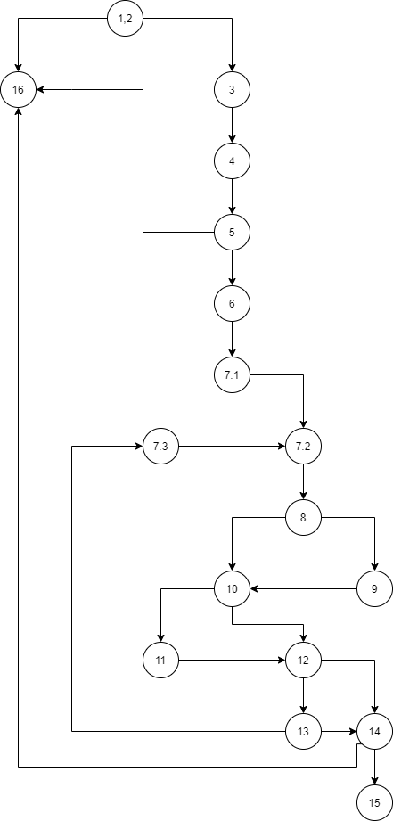

# Втора лабораториска вежба по Софтверско инженерство

## Фисник Сулимани, бр. на индекс 161206

### Група на код:
Ја добибв групата на код 4
 
### Control Flow Graph

 
### Цикломатска комплексност
Цикломатската комплексност на овој код е 7,истата ја добив преку формулата V(G) = E – N + 2 каде E претставува бројот на ребра во графот, а N претстaвува бројот на јазли во графот. Во случајов Е=22, N=17, па цикломатската комплексност изнесува: 22-17+2 = 7.
